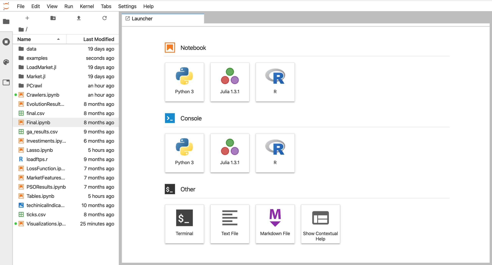
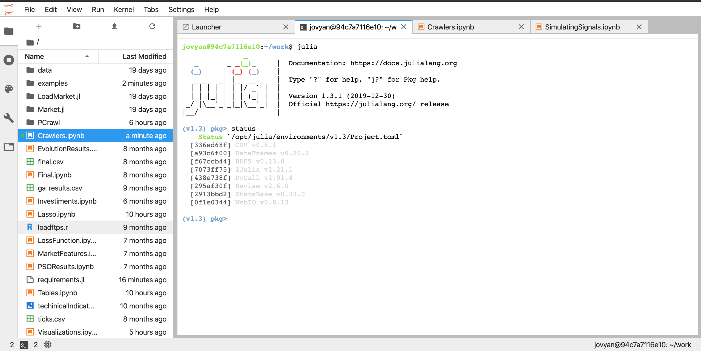

==========================
Setting Up the Environment
==========================

Code Base
=========

The code for the application is written in Julia. The examples are displayed in 
Jupyter Lab. You can choose to install Julia and Jupyter Lab in your machine locally,
but the source code comes with a docker image that can be used to run the examples and code
in your machine. It also comes with a Makefile with usefull comands (only works out-of-the-box in
Linux and Mac).

.. tip:: 
   The setup was created with the Docker approach in mind, so it shoul be easier to use.

To install Julia and Jupyter Lab in your computer, follow the instructions:

- `Install the Julia Language executable <https://julialang.org/downloads/>`_
- `Install Python <https://www.python.org/downloads/>`_
- `Install Jupyter Lab <https://jupyterlab.readthedocs.io/en/stable/getting_started/installation.html/>`_
- Configure Julia to run with Jupyter Lab (link pending)

Instead, the setup for using the Docker image is as simple as:

- `Install the Docker client <https://docs.docker.com/install/>`_

Running with Docker
-------------------

If you are in a Linux/Mac environment, after you have Docker, you can cd into the code root
directory and type in the terminal::

    make start 

At the first time, docker will download the image first, so this can take a while, but will be
pretty fast afterwards. After the containers have start, type::

    make link 

A link will appear in your terminal (if not, try the command again). Click the link or paste it in the browser
to access the Jupyter Lab Interface.

Dealing with Julia in Jupyter Lab
---------------------------------

In order to use the code with flexibility, some knowledge of `Julia <https://docs.julialang.org/en/v1/>`_  
is required. The Jupyter Lab interface makes it possible to launch different file types and 
executables, including terminal sessions.

Terminal sessions can be usefull to download new julia packages, as well as mantain your current
enviroment. if you opena a terminal session and type 'julia', the julia cli will appear.
To enter julia package management enviroment just press ']'. From there, you can check the installed
packages typing 'status'.

If you need to install any further packages, just type::

    add <package-name>

To better understand the Julia package manager, `check the reference <https://docs.julialang.org/en/v1/stdlib/Pkg/index.html>`_.

.. tip:: 
   Julia Lab makes it easy to have multiple tabs open at the same time. Leave one 
   open in the Julia pkg terminal to easily install the packages you will need.

Code Considerations
-------------------

The Julia language works on top of a just-in-time (jit). This is what allows it
to have `performance close to C language <https://julialang.org/benchmarks/>`_  
while possesing higher level abstractions. Every time a module is loaded, it is pre-compiled.

Currently, the PCrawl module is very heavy, and so may take a while to import and compile. 
Some warnings may also appear, but they are ok to be ignored for now.

The package Revise permits the module to reload during development, and should be imported before
all others. With it, it is possible to alter the package code, save the file, and immediatly see
the new implementation in the Notebook without having to compiling it again, which can become 
cumbersome very quickly.

Julia allows for math symbols such as :math:`\alpha` to be used as variables . 
In the documentation, when a function's arguments are declared they will be represented 
by the corresponding text (\\alpha), with the symbol (:math:`\alpha`) being used in the description. 